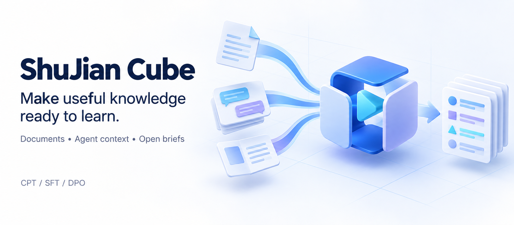
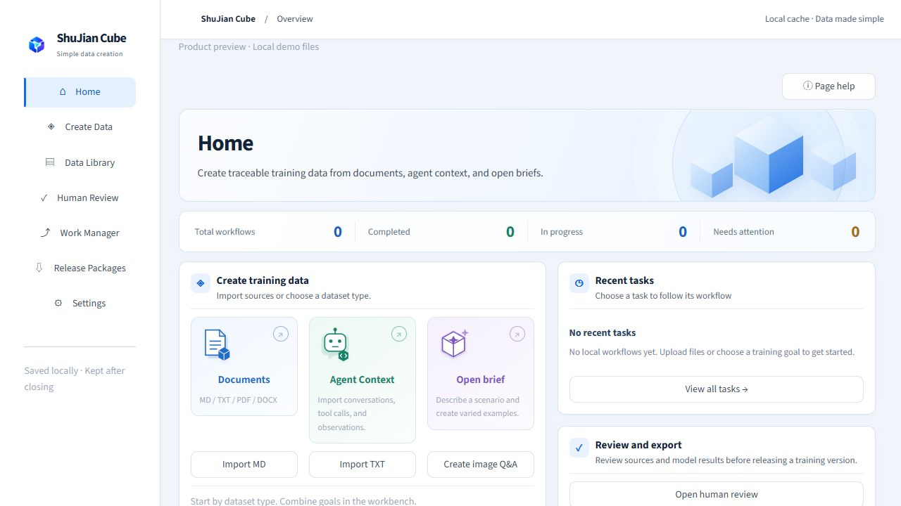
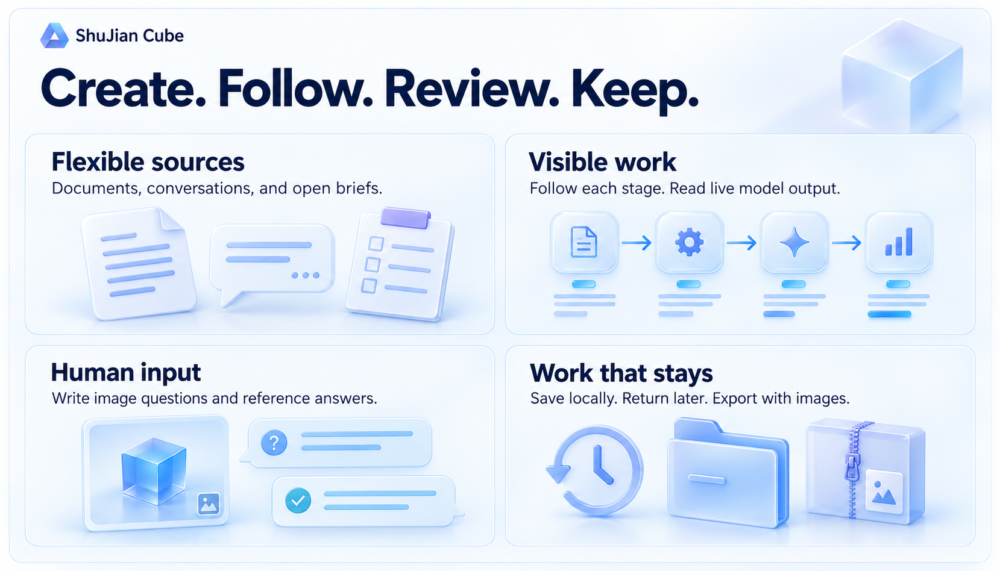
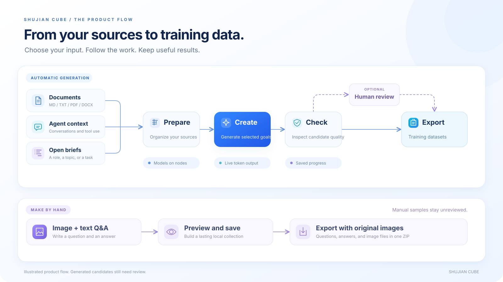
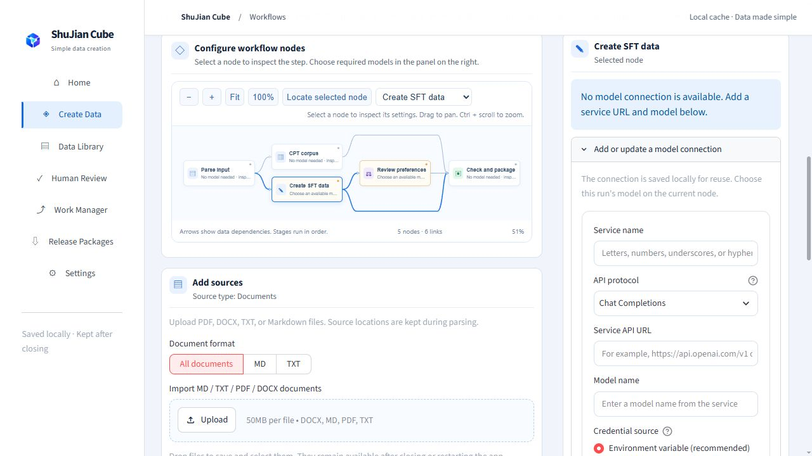
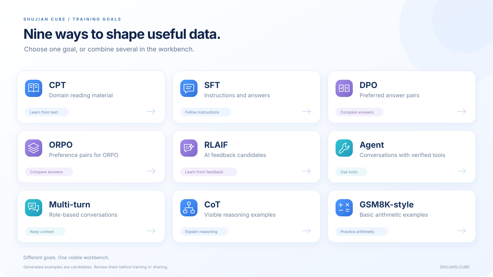
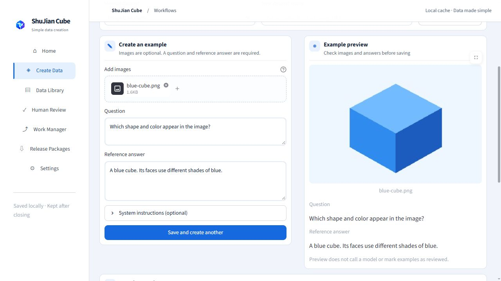

  

<h1 align="center">ShuJian Cube</h1>

<strong>Your knowledge. A visible workflow. Better training examples.</strong>

  
  
  

  <a href="#meet-the-workbench">Workbench</a> ·
  <a href="#follow-the-work">Workflow</a> ·
  <a href="#choose-your-data">Data types</a> ·
  <a href="#make-image-examples-by-hand">Image Q&amp;A</a> ·
  <a href="#start-in-a-few-steps">Get started</a>

ShuJian Cube helps you turn documents, agent conversations, and open briefs into training data. Choose a goal. Follow the work. Review the results. Return to your saved tasks whenever you need them.

## Meet the workbench

One place to start, follow, and refine your work. The home screen brings new tasks and recent activity together. The interface is available in English and Chinese.

  

| Bring your own sources | Stay close to the process | Build at your own pace |
| --- | --- | --- |
| Import MD, TXT, PDF, or DOCX files. Add agent context or describe a task. | Select a node to set its model and token limits. Open it to watch live output. | Generate in batches. Keep saved results. Return to local work history. |

  

## Follow the work

See the path from source material to a finished collection. Each stage has a clear purpose. Status and sample previews help you spot work that needs attention.

  

Open a model node to watch its response arrive as a token stream. For larger jobs, choose a batch size and follow progress. If a run fails, retry from saved checkpoints. Completed results remain available.

  

## Choose your data

Select one goal or combine several. Create CPT text, SFT instructions, DPO or ORPO preference pairs, and RLAIF feedback. You can also create agent traces, multi-turn conversations, visible CoT examples, and GSM8K-style arithmetic examples.

  

## Make image examples by hand

Some examples need a human touch. Add PNG, JPEG, or WEBP images. Write a question and a reference answer. Preview the sample, save it, and continue with the next one.

Find saved samples in the data library. Export a ZIP with the questions, answers, and original images. Manual samples are marked as unreviewed. Check them before use.

  

## Start in a few steps

On Windows, open [the launcher](scripts/start_all.vbs). Then:

1. Add files, agent context, or a short brief.
2. Choose your data goals and configure the model nodes.
3. Start generation and open a node to follow its output.
4. Review your samples, then export the collection.

For image Q&A, choose **Create image Q&A** instead. No model connection is needed to write these samples.

## Responsible use

Generated data can be wrong. Review accuracy, safety, and privacy before training or sharing. Only use sources and images you have permission to process. Model services may receive the content you submit. Quality depends on your sources, model, and review.

## License and notices

ShuJian Cube is available under the [Apache License 2.0](LICENSE). See [NOTICE](NOTICE) for third-party acknowledgments. Screenshots show the real app with local demo files. Promotional illustrations explain the product and do not report measured results.
