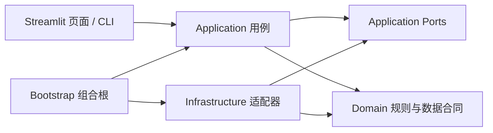

# DataForge 架构与技术栈

平台主运行时统一使用 Python 3.11：Streamlit 提供桌面浏览器工作台，Python 应用服务连接数据生成、文件解析、模型调用和持久化。仓库中的 Node 依赖用于已有 Web Component 回归测试与可选插件开发，不作为平台启动服务，也不引入第二套产品 API。

## 洋葱依赖方向

Domain 不依赖框架、磁盘或模型 SDK。Application 描述用户动作、用例与向外部能力请求的端口。Infrastructure 实现端口，并负责文件、SQLite、LLM API、文档解析和压缩包。Presentation 只呈现状态、收集输入并调用用例。Bootstrap 是唯一负责把应用用例接到实际适配器的位置。

## 当前迁移状态

自动数据生成、工作区选择、数据目录、生成偏好设置、模型后端与密钥配置，SFT 对话、CPT 语料、DPO/ORPO 偏好审核，以及旧对话样本的质量报告与版本导出已形成洋葱式切片：

| 边界 | 当前目录 | 职责 |
| --- | --- | --- |
| Domain | `lib/domain/` | 训练目标、数据资产分类、导出合同、JEV/对话质量规则、工具与整数算术核验、模型后端配置规则，以及 SFT/CPT/偏好审核规则 |
| Application | `lib/application/` | 自动工作流、工作区、数据目录、生成设置、模型后端管理和训练数据审核用例与端口协议 |
| Infrastructure | `lib/infrastructure/` | 文件工作流执行器、受限且避开链接的数据目录扫描与下载、固定配置文件的原子更新、审核事件及版本化发布、模型配置/密钥/审计适配 |
| Bootstrap | `lib/bootstrap/` | 工作流、工作区、生成设置、模型后端和训练数据审核依赖装配 |
| Presentation | `lib/presentation/streamlit/` 与 `lib/webapp.py` | 数据生成工作台、真实样本预览、数据目录、任务运行图、打包和统一人工审核工作区 |

现有完整控制台和旧 CLI 仍保留在 `lib/webapp.py`、`lib/cli.py`；历史 SFT/rollout 审核中心、模型训练、旧文档管线、通用导出器和监控暂时仍由兼容模块承接。数据目录现在由 `AssetCatalogApplication` 返回文件元数据，受限读取与链接检查在 `FilesystemAssetCatalogDriver` 中完成，页面不递归扫描磁盘。旧审核中心的无损样本修订规则已抽入 `lib/domain/review_edit.py`，字段级 AI 建议由 `ReviewEditApplication` 经 `ReviewSuggestionPort` 调用模型适配器；`lib/review_editor.py` 仅保留旧调用入口。自动工作流产生的 SFT、CPT、DPO 与 ORPO 样本均可在统一审核工作区复核并形成独立审核版本。`lib/workflow.py`、`lib/workflow_quality.py`、`lib/math_tasks.py` 与 `lib/backend_manager.py` 是迁移期的旧导入入口，新代码应依赖 Application 用例或 Domain 包。

继续迁移时按业务闭环移动“人工审核与审核存储 → 版本化导出与数据集注册 → 文档/会话生成 → 模型训练与监控”。每条闭环先定义纯 Domain 合同和 Application 端口，再接 Infrastructure 适配器，最后迁移页面和 CLI。只有调用点迁移并通过原行为回归后才移除兼容入口；不在重构期间改写用户数据目录。

生成偏好页面由 `lib/presentation/streamlit/generation_settings_page.py` 呈现，经 `GenerationSettingsApplication` 读取和校验固定的三份 YAML；文件适配器按预期内容比较、保留原版备份并原子替换。配置语法错误时，页面仍提供高级编辑入口用于修复。页面不再直接读写这些配置文件。

CPT 文档导入按 UTF-8、GB18030 显式解码，无法解码的来源会隔离并给出 `invalid_encoding`，而非替换乱码继续生成。语料规范化保留独占一行的数字及代码缩进，避免把真实编号或程序片段误当页码噪声删除。
CPT 打包前复核任务创建时锁定的同工作区人工审核版本，并对当前批次与这些发布版本做保守精确/近重复筛查；跨批匹配会保留参考运行、版本、行号和相似度。用户也可为 CPT 任务提供本地 JSON/JSONL 评测参照，来源快照与哈希锁定在运行配方中，打包前验证并隔离命中候选；Domain 的重叠索引只返回参照 ID 和位置，不返回评测原文。此检查只覆盖上传的参照，候选索引可能漏检，且目前尚无训练后的数据效用基准。

Agent 回放的纯状态机合同在 `lib/domain/agent_sandbox_contract.py`，可选 Docker 执行器在 `lib/infrastructure/agent_docker_replay.py`。Domain 只接受 `SandboxReplayPort` 返回的标量结果与摘要证据，完整轨迹和终态目标都要核对；Infrastructure 把有界动作与来源快照通过 stdin 交给固定摘要镜像，容器不能挂载宿主文件或联网。任务创建时锁定镜像，未配置或容器不可用不会降低默认本地工具适配器的验证要求。

旧对话样本的结构检查、当前内容审核共识与版本放行规则现位于 `lib/domain/release_quality.py`，`ReleaseApplication` 经端口读取样本和审核票、写出带清单的版本；CLI 和控制台通过 `lib/bootstrap/releases.py` 调用。`lib/quality.py` 只保留兼容入口，文件格式转换器仍由旧 `lib/exporters.py` 提供。这里的审核覆盖与结构检查不等于事实准确性证明。

## 工作流依赖规则

审核分页合同现在通过 Application 端口传入数据适配器。CPT、SFT、DPO、ORPO 按全队列状态筛选后分页，页面每次最多读取 100 条，默认 20 条；待审队列完成最后一页后会自动回到有效页码。基础设施为已校验产物建立可重建的 SQLite 索引，按来源哈希和索引版本失效；候选正文和来源证据在索引建立时逐条读取，翻页只解析当前页。索引只在运行的 `human-review/.indexes/` 下缓存，不改变原始产物或人工审核事件，发布仍重新校验原始产物。SFT 审核页复用数据预览的真实轮次卡片，输入、助手回答、工具调用与返回保持原始顺序。

5 万条离线 SFT 候选（每条约 1 KB 回答）的本地检查中，首次校验并建索引约 12.66 秒，索引就绪后读取末尾 20 条约 0.16 秒，Python 分配追踪峰值约 0.26 MiB。该检查包含产物哈希核对与当前页来源证据，不调用模型；不是模型生成吞吐量或整个进程内存的测量。审核事件现在统一写入 SQLite 事务存储，单条保存追加事件并更新当前决定。旧 JSON 记录逐条校验并事务迁入，原文件保留且检测后续修改。完整发布逐条写出训练数据与审计快照，并在磁盘生成和复核 ZIP；页面只保留版本摘要，点击下载才读取归档。Streamlit 下载仍可能分配整个归档的字节缓冲，这不等于 HTTP 流式下载。

同一套 5 万条离线候选全部审核后，读取末尾 20 条约 0.83 秒，追加单条决定约 0.08 秒；完整发布生成约 6.57 MiB ZIP，Python 分配追踪峰值约 7.6 MiB。开启 `tracemalloc` 时发布耗时约 270.51 秒，此数值包含完整审计与产物复核，不能当作无追踪环境的性能或模型吞吐量。大批量发布仍同步执行，异步进度与任务恢复交互尚待完善。

- `lib/domain` 不能导入 `lib.application`、`lib.infrastructure`、`lib.bootstrap`、Streamlit 或 LLM SDK。
- `lib/application` 可以依赖 Domain 和自己定义的 Protocol；不能直接导入 Infrastructure、Presentation 或框架。
- `lib/infrastructure` 可以实现 Application 的 Protocol 并调用 Domain 规则。
- `lib/bootstrap` 装配具体实现；UI/CLI 通过 Application 服务进入工作流。
- Infrastructure 中的文件布局、模型 SDK 与数据库实现不能泄漏进业务合同；页面使用预览、状态和打包用例读取工作流。
