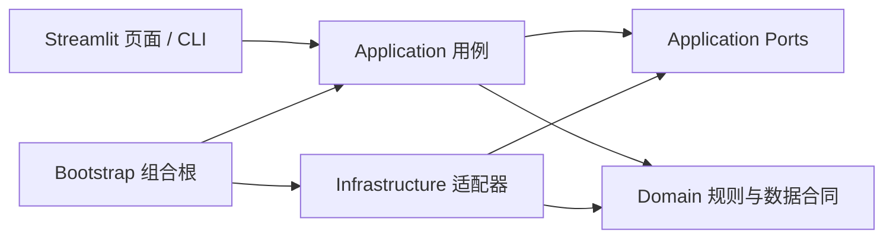

# DataForge 架构与技术栈

平台主运行时统一使用 Python 3.11：Streamlit 提供桌面浏览器工作台，Python 应用服务连接数据生成、文件解析、模型调用和持久化。仓库中的 Node 依赖用于已有 Web Component 回归测试与可选插件开发，不作为平台启动服务，也不引入第二套产品 API。

Windows double-click startup now selects `scripts/launch_desktop.py`. The native pywebview shell embeds the existing loopback workbench with WebView2. It does not expose a Python bridge or add another product API. Downloads are enabled for dataset export; file URLs are disabled. The shell waits for both the UI and review API, reuses a healthy service, or starts the existing windowless service launcher with `--service-only`. The service keeps its existing single-instance lock. Closing the desktop window leaves the service running so long tasks continue. Multiple shell windows can share that service. An unsuccessful new service child is reported; a timed-out child owned by this launch is terminated. Existing healthy services are never terminated by the shell.

`scripts/launch_console.py` remains the explicit browser entry. Directory creation and log opening fail visibly before loading dependencies or starting services. Desktop failures use `desktop.log`; service failures use `console.log`. Lifecycle tests mock the GUI and message boxes. On Windows the shell enables renderer accessibility in its process environment while preserving existing browser arguments. Native checks confirmed a loaded home document, navigation, workspace controls, and real task statistics through Windows accessibility. Closing one native window left the other window and both service health checks intact. Screenshot capture failed with the system `SetIsBorderRequired` interface error. Native upload and dataset download dialogs remain unverified.

## 洋葱依赖方向

```mermaid
flowchart LR
  UI[Streamlit 页面 / CLI] --> APP[Application 用例]
  APP --> PORTS[Application Ports]
  APP --> DOMAIN[Domain 规则与数据合同]
  INFRA[Infrastructure 适配器] --> PORTS
  INFRA --> DOMAIN
  BOOT[Bootstrap 组合根] --> APP
  BOOT --> INFRA
```

Domain 不依赖框架、磁盘或模型 SDK。Application 描述用户动作、用例与向外部能力请求的端口。Infrastructure 实现端口，并负责文件、SQLite、LLM API、文档解析和压缩包。Presentation 只呈现状态、收集输入并调用用例。Bootstrap 是唯一负责把应用用例接到实际适配器的位置。

## 当前迁移状态

自动数据生成、工作区选择、数据目录、生成偏好设置、模型后端与密钥配置，SFT 对话、CPT 语料、DPO/ORPO 偏好审核，以及旧对话样本的质量报告与版本导出已形成洋葱式切片：

| 边界 | 当前目录 | 职责 |
| --- | --- | --- |
| Domain | `lib/domain/` | 训练目标、数据资产分类、导出合同、JEV/对话质量规则、工具与整数算术核验、模型后端配置规则，以及 SFT/CPT/偏好审核规则 |
| Application | `lib/application/` | 自动工作流、工作区、数据目录、生成设置、模型后端管理和训练数据审核用例与端口协议 |
| Infrastructure | `lib/infrastructure/` | 文件工作流执行器、受限且避开链接的数据目录扫描与下载、固定配置文件的原子更新、审核事件及版本化发布、模型配置/密钥/审计适配 |
| Bootstrap | `lib/bootstrap/` | 工作流、工作区、生成设置、模型后端和训练数据审核依赖装配 |
| Presentation | `lib/presentation/streamlit/` 与 `lib/webapp.py` | 数据生成工作台、真实样本预览、数据目录、任务运行图、打包和统一人工审核工作区 |

现有完整控制台和旧 CLI 仍保留在 `lib/webapp.py`、`lib/cli.py`；历史 SFT/rollout 审核中心、模型训练、旧文档管线、通用导出器和监控暂时仍由兼容模块承接。数据目录现在由 `AssetCatalogApplication` 返回文件元数据，受限读取与链接检查在 `FilesystemAssetCatalogDriver` 中完成，页面不递归扫描磁盘。旧审核中心的无损样本修订规则已抽入 `lib/domain/review_edit.py`，字段级 AI 建议由 `ReviewEditApplication` 经 `ReviewSuggestionPort` 调用模型适配器；`lib/review_editor.py` 仅保留旧调用入口。自动工作流产生的 SFT、CPT、DPO 与 ORPO 样本均可在统一审核工作区复核并形成独立审核版本。`lib/workflow.py`、`lib/workflow_quality.py`、`lib/math_tasks.py` 与 `lib/backend_manager.py` 是迁移期的旧导入入口，新代码应依赖 Application 用例或 Domain 包。

继续迁移时按业务闭环移动“人工审核与审核存储 → 版本化导出与数据集注册 → 文档/会话生成 → 模型训练与监控”。每条闭环先定义纯 Domain 合同和 Application 端口，再接 Infrastructure 适配器，最后迁移页面和 CLI。只有调用点迁移并通过原行为回归后才移除兼容入口；不在重构期间改写用户数据目录。

生成偏好页面由 `lib/presentation/streamlit/generation_settings_page.py` 呈现，经 `GenerationSettingsApplication` 读取和校验固定的三份 YAML；文件适配器按预期内容比较、保留原版备份并原子替换。配置语法错误时，页面仍提供高级编辑入口用于修复。页面不再直接读写这些配置文件。

CPT 文档导入按 UTF-8、GB18030 显式解码，无法解码的来源会隔离并给出 `invalid_encoding`，而非替换乱码继续生成。语料规范化保留独占一行的数字及代码缩进，避免把真实编号或程序片段误当页码噪声删除。
CPT 打包前复核任务创建时锁定的同工作区人工审核版本，并对当前批次与这些发布版本做保守精确/近重复筛查；跨批匹配会保留参考运行、版本、行号和相似度。用户也可为 CPT 任务提供本地 JSON/JSONL 评测参照，来源快照与哈希锁定在运行配方中，打包前验证并隔离命中候选；Domain 的重叠索引只返回参照 ID 和位置，不返回评测原文。此检查只覆盖上传的参照，候选索引可能漏检，且目前尚无训练后的数据效用基准。

Agent 回放的纯状态机合同在 `lib/domain/agent_sandbox_contract.py`，可选 Docker 执行器在 `lib/infrastructure/agent_docker_replay.py`。Domain 只接受 `SandboxReplayPort` 返回的标量结果与摘要证据，完整轨迹和终态目标都要核对；Infrastructure 把有界动作与来源快照通过 stdin 交给固定摘要镜像，容器不能挂载宿主文件或联网。任务创建时锁定镜像，未配置或容器不可用不会降低默认本地工具适配器的验证要求。

旧对话样本的结构检查、当前内容审核共识与版本放行规则现位于 `lib/domain/release_quality.py`，`ReleaseApplication` 经端口读取样本和审核票、写出带清单的版本；CLI 和控制台通过 `lib/bootstrap/releases.py` 调用。`lib/quality.py` 只保留兼容入口，文件格式转换器仍由旧 `lib/exporters.py` 提供。这里的审核覆盖与结构检查不等于事实准确性证明。

## 工作流依赖规则

### Arithmetic generator and validation

New recipes pin `math_generator_version=2`. Four deterministic multi-step integer families cover grouped addition, grouped subtraction, repeated daily totals, and balanced redistribution. Every calculation annotation is evaluated with bounded AST arithmetic; the single terminal `####` integer must equal the computed final result. Invalid annotations, wrong intermediate calculations, trailing unchecked text, and excessive expression size or depth are rejected. Calculation steps and generator version are retained in the quality records; the native training schema remains `question` and `answer`. Unversioned recipes continue using the original version-1 generator, so restored checkpoints keep the original question distribution.

This is synthetic arithmetic, not a general mathematical proof verifier or a substitute for GSM8K itself. Short multiline answers render as numbered calculation steps plus a final-answer card. Nonstandard or long answers retain the full existing text preview. The renderer formats recorded content without claiming it independently verifies the math. References: [GSM8K calculation annotations](https://github.com/openai/grade-school-math) and [TRL reward functions](https://huggingface.co/docs/trl/rewards).

审核分页合同现在通过 Application 端口传入数据适配器。CPT、SFT、DPO、ORPO 按全队列状态筛选后分页，页面每次最多读取 100 条，默认 20 条；待审队列完成最后一页后会自动回到有效页码。基础设施为已校验产物建立可重建的 SQLite 索引，按来源哈希和索引版本失效；候选正文和来源证据在索引建立时逐条读取，翻页只解析当前页。索引只在运行的 `human-review/.indexes/` 下缓存，不改变原始产物或人工审核事件，发布仍重新校验原始产物。SFT 审核页复用数据预览的真实轮次卡片，输入、助手回答、工具调用与返回保持原始顺序。

5 万条离线 SFT 候选（每条约 1 KB 回答）的本地检查中，首次校验并建索引约 12.66 秒，索引就绪后读取末尾 20 条约 0.16 秒，Python 分配追踪峰值约 0.26 MiB。该检查包含产物哈希核对与当前页来源证据，不调用模型；不是模型生成吞吐量或整个进程内存的测量。审核事件现在统一写入 SQLite 事务存储，单条保存追加事件并更新当前决定。旧 JSON 记录逐条校验并事务迁入，原文件保留且检测后续修改。完整发布逐条写出训练数据与审计快照，并在磁盘生成和复核 ZIP；页面只保留版本摘要，点击下载才读取归档。Streamlit 下载仍可能分配整个归档的字节缓冲，这不等于 HTTP 流式下载。

同一套 5 万条离线候选全部审核后，读取末尾 20 条约 0.83 秒，追加单条决定约 0.08 秒；完整发布生成约 6.57 MiB ZIP，Python 分配追踪峰值约 7.6 MiB。开启 `tracemalloc` 时发布耗时约 270.51 秒，此数值包含完整审计与产物复核，不能当作无追踪环境的性能或模型吞吐量。审核发布现经 Application 的后台任务端口启动固定本地子进程；状态在 `human-review/.jobs/` 下落盘，页面只轮询来源、审核记录、样本写出、快照、压缩与完整性校验阶段。活动文件锁判定工作进程，刷新或控制台重启后可恢复查看；失去工作锁的运行任务标记中断，可重新打包。停止是检查点协作停止，保留既有完整版本与未发布的暂存文件，不提供逐字节恢复压缩。发布期间页面暂停当前批次审核，避免争用全量校验持有的锁。

- `lib/domain` 不能导入 `lib.application`、`lib.infrastructure`、`lib.bootstrap`、Streamlit 或 LLM SDK。
- `lib/application` 可以依赖 Domain 和自己定义的 Protocol；不能直接导入 Infrastructure、Presentation 或框架。
- `lib/infrastructure` 可以实现 Application 的 Protocol 并调用 Domain 规则。
- `lib/bootstrap` 装配具体实现；UI/CLI 通过 Application 服务进入工作流。
- Infrastructure 中的文件布局、模型 SDK 与数据库实现不能泄漏进业务合同；页面使用预览、状态和打包用例读取工作流。

节点模型草稿与提交快照由 `WorkflowNodeModelsApplication` 经库存端口处理，Domain 负责首次默认选择、所需角色与服务存在性检查。工作台不再直接调用旧 backend 管理模块。已有节点的手动选择不随全局默认变化；服务消失时保留原选择并提示修复，画布标出缺配置节点，未修复前禁用启动。提交时再次读取库存，避免使用页面渲染时过期的服务列表。自定义模型名仍可使用，服务中的模型列表不当作远端可用性的证明。
### Large-run recovery visibility

The run inspector separates verified item checkpoints reused in the current attempt from newly processed units. Newly processed units can still reuse saved model responses, so this count is not a count of new model calls. Resume keeps the original source snapshots and node recipe. The execution engine verifies pinned recipe, prompt, source, and model identities before proceeding.

Input quarantine previews use the incremental JSON-array reader through the workflow application port. The application caps requests at 100 records. The filesystem adapter stops at the requested number of quarantined records and closes the reader. This bounds preview memory while preserving the saved complete input records. Finding rare quarantined rows can still require scanning the source array; this preview is not an indexed page.
### Automatic workflow archive delivery

Automatic candidate ZIP files are written to the run's `delivery/` directory. Archive preparation verifies source files, writes a temporary ZIP, streams all archived members for hash verification, rechecks the source manifest, and atomically publishes the ZIP and a small reference. The manifest fingerprint identifies the archive. Concurrent preparation is serialized by a file lock. Failed preparation never creates a ready reference.

The package page retains only path, byte count, fingerprint, and SHA-256 in its session. A fresh session discovers the saved package through the application port. A changed manifest invalidates the cached package; damaged ZIP bytes require preparation again. Package inventory and cached delivery discovery share one source verification per page render. Individual trainer downloads are deferred and rechecked by the infrastructure adapter.

Browser downloads are capped at 50 MiB. Larger prepared archives remain available through their displayed local paths. This bounds browser delivery buffers while allowing large local datasets. Automatic archive preparation now shares the durable local worker mechanism with human-review publication. Its job state is isolated under `delivery/.jobs/workflow.json`. The page polls only that small status file while active, with source verification, compression, archive verification, source recheck, and publication phases. Compression and archive verification report actual byte totals and check cancellation between chunks. Source verification remains a whole-file check, so cancellation can wait for that check to finish. Interrupted jobs can be retried; existing complete archives remain available. Compression retries start a new temporary ZIP rather than resume compressed bytes.
### Long-message preview controls

Training artifact previews opt into collapsible message rendering for content or tool payloads longer than 1,600 characters. The compact summary contains a short escaped excerpt. The complete rendered message remains inside a named, keyboard-focusable scroll region with a maximum height of 420 pixels. Tool-call grouping, recorded ordering, and failure markers stay outside the collapsed payload. English controls are translated while excerpts and full training text retain their original language. The shared renderer's default remains unchanged for callers that do not request compact previews. This controls visual height; it is not lazy DOM loading of an individual message.

Long plain-text corpus, evidence, and structured-record previews share the same compact disclosure and scroll region as long messages. Evidence and unknown structured rows are no longer silently truncated. Full payloads remain in the rendered DOM; these controls bound visible height rather than payload memory. Nested body scrolling is disabled inside the full-content region so keyboard scrolling has one target.

### Agent node verification choice

The Agent setup node owns the local or isolated replay choice. A separate session draft survives switching to another node. Isolated replay requires a valid pinned image configuration before starting; actual Docker availability is checked during execution. The application capability reports configuration only. Task creation validates the current configuration again and stores the selected image in the immutable recipe. Explicit local replay ignores the container environment. Existing CLI callers retain the configured environment default. The node explains conservative duplicate pruning and the separate destination for failed traces; neither mechanism makes uploaded snapshots proof of external truth.

### Creation and run inspection

The creation workbench lists past runs without rendering their execution details. Opening a selected run uses the same task-center handoff as starting a new run. The task center owns live inspection, checkpoint retry, and packaging navigation. This avoids reading a selected historical run's artifacts and event details during creation form rerenders, and keeps old failures separate from a new configuration. Refreshing a workspace still discovers its persistent history.

The creation form keeps run name and candidate count visible. Optional source notes, processing limits, concurrency, batch size, and document chunk size are expandable. The dependency overview is inside its detail disclosure; the interactive node canvas stays visible. These disclosures do not defer widget execution or change persisted recipe values. A 50,000-candidate UI regression verifies edited concurrency and batch size survive node selection and are saved into the new recipe. Completed-run selectors in the shared preview use compact task summaries rather than loading full run state into every selector.

New open-brief recipes use planning policy version 2. Planning requests carry the selected training goals and a 512-character task limit. Each batch must have the requested number of valid tasks. NFC normalization and collapsed whitespace detect exact duplicates within and across accepted batches; this does not provide semantic deduplication or a coverage guarantee. Invalid batches stop planning and discard only their model-response checkpoint. Retrying reuses earlier accepted batches. Recipes without this policy version retain their prior request and validation behavior. The run banner and selected-node panel explain planning failures in the selected interface language.

Read-only artifact preview keeps up to 16 successful integrity leases in process memory. Each lease covers the complete manifest and file inventory and expires at the next 30-second monotonic time boundary. File size, inode, modification time, creation/change time, inventory changes, or symlinks invalidate reuse. The inventory is checked before and after reading a sample. Metadata-preserving external edits can remain undetected until the lease expires; this optimization is for local browsing, not a fresh cryptographic attestation on each click. Downloads, packaging, and release verification still use the uncached verifier. On the existing 50,000-row offline fixture, four sample reads triggered one full verification; the first read took 0.126 seconds, the first last-row seek took 0.168 seconds, and the following adjacent reads took 0.001–0.002 seconds on this machine.

The asset catalog is a standalone Streamlit presentation module. The entry point supplies an AssetCatalogApplication and workspace ID; the page does not import bootstrap, workspace storage, or infrastructure adapters. The catalog shows 100 files per page with search and category filters. Only multi-page results expose navigation controls. Selected-file keys include the current page, and changing the search or category selects that result set's first page initially. The bounded inventory scan still applies; pagination exposes all scanned matches, not files beyond that scan limit. Console AppTests select registered routes directly because the sidebar now uses buttons rather than the removed navigation radio.

Agent preview groups adjacent tool results only when their IDs match the current call group. Unrelated or duplicate results remain separate. A parallel call group with missing results cannot display a verified-step badge, even when verification metadata lists the call IDs. Anthropic messages containing both tool results and new user text start a new dialogue turn. Long tool outputs retain their complete recorded text in a disclosure instead of truncating the expanded content at 20,000 characters. This still renders the complete content into the page; it is not lazy loading. Interface fallback labels translate independently from user-supplied tool names and IDs.

The shared interactive preview now renders at most eight conversation groups per selected section. Data-library artifacts, existing conversation files, package previews, and SFT review use this component. Sections preserve complete user turns and adjacent matching tool exchanges. Turn and step numbers keep their original offsets; negative traces open the section containing the recorded failure by default. Previous/next section controls and an absolute section number are available. A 1,000-turn browser fixture rendered only turns 993–1000 on the last section, with 7,415 characters in the preview article HTML. The server still decodes the full selected record and scans its group boundaries. A single unusually large turn, tool exchange, or argument payload remains unbounded within its section. This change bounds rendered groups, not server memory for a single record.

Conversation structure now belongs to `lib.domain.conversation_structure`. Tool-call aliases, embedded result blocks, user-turn boundaries, and adjacent call/result ranges have one implementation used by both timeline rendering and section navigation. The domain module imports only the standard library and does not generate HTML or access Streamlit/storage. Window indexing consumes the range iterator directly instead of materializing every group. A 50,000-step fixture produces 6,250 section offsets with less than 2 MiB of Python-traced allocations during indexing; input records are excluded from this measurement. Metadata still grows with the number of sections.

The Agent node offers an explicit local environment check through the workflow application port. It validates the configured image reference, calls Docker info, and inspects the pinned image's Linux amd64 platform. Each subprocess has a five-second timeout and runs without a visible console. The check never pulls an image or starts a container. Readiness is an observation, not a replay guarantee or a persistent launch gate. Missing CLI, unavailable daemon, absent image, invalid configuration, and platform mismatch have separate localized messages. On this development host the CLI exists but the Docker Desktop Linux engine is unavailable; actual isolated-container replay remains unverified.

Stage throughput excludes reused item checkpoints. Each attempt clears prior rate and ETA values. Timing starts when the first uncached item begins, and rate uses completed uncached items over elapsed wall time from that point. A stage that only reuses item checkpoints leaves both estimates unset, while preserving completed and reused counts. Remaining time is an estimate for remaining units; individual model responses can still be reused inside an uncached item. This is processing throughput, not provider token throughput or a cost estimate.

The dataset browser is an independent presentation module. Composition supplies the workflow application, workspace ID, and existing-file selection callback. The page imports no storage, bootstrap, or workspace adapters. Existing-file preview supports previous/next and absolute sample position, with positions retained per workspace and file outside transient widget state. File names and sample IDs are marked as user content during localization. The original complete file loader remains available to bulk review and quality operations.

Tool-call preview retains the compact parameter summary and adds a native disclosure with complete arguments. Structured arguments use readable JSON; non-JSON strings remain unchanged. Expanded arguments are escaped text, preserve user content during localization, and scroll within a 320-pixel panel. Call IDs are displayed in full with wrapping. The summary still abbreviates long values; the disclosure provides the complete record. Complete arguments are present in the DOM, so this is not lazy loading or a bound on unusually large argument payloads.

Task cards use pages of 50 matching runs. Filter or search changes reset the page; pagination clamps after the number of matches changes. Explicit creation/history handoffs clear stale filters and search, and locate the selected run's page before choosing the visible record. This bounds rendered task cards, not the run inventory read by the adapter.

The task-center and creation-history views now use a separate task-inventory application port. Its filesystem adapter caches compact summaries for up to 2,048 file identities. Summaries retain card fields, stage labels/statuses, and three recent events. Each access checks the state's nanosecond modification/change times, size, and inode; reading across a replacement retries before caching. Callers receive copies. Other workflow consumers and selected-run inspectors still read authoritative full states. The first read and cache misses parse a full state, and directory inventory still scans all run paths. This is not a persistent indexed inventory or a guarantee against undetectable external metadata-preserving edits.

User-owned workflow names use the `UntranslatedText` string marker when passed through localized Streamlit labels. Run headings and task-card buttons keep the original name. History options translate the system status separately, then preserve the combined label. Their language is captured during rendering so formatting outside the Streamlit script context stays stable. Stage inspector status and percentage use separate text nodes to translate the status consistently.

HTML user-content regions use `data-user-content` to preserve text and nested attributes through markup localization. Package task/release names, source names, and file names use this marker. Run configuration values mark actual source names, model identifiers, and written briefs, while empty-brief and missing-model placeholders remain system copy. This is a localization boundary, not an HTML safety mechanism; values are still escaped before rendering.

### Absolute sample navigation

Completed task details open the shared sample browser with the run and target selected. The route also selects the workflow result view, so a previous file view cannot hide the requested sample. Failed agent traces use the same browser but stay in their separate artifact. Task details no longer retain a separate three-example session cache. Each browser read still verifies artifact integrity.

The data-library preview accepts a sample number across the complete manifest count and requests one native record. The application bounds the request size and normalizes negative offsets. JSONL previews build a sparse binary byte-offset index every 128 nonempty lines on the first nonzero-offset request. The first-record preview skips index construction. A process-local cache retains up to 16 file identities; a 50,000-row file needs 391 offsets. Indexed reads skip at most 127 nonempty lines before decoding selected rows. File replacement invalidates the index by metadata identity, with a post-read change check. Existing full artifact-manifest SHA-256 verification still runs before preview reads; its cost is not removed by the index. Index construction scans the full selected file once and does not persist across server restarts.

The preview card has previous/next example controls with disabled first/last boundaries. Callbacks update the same per-workspace/run/target position used by absolute navigation. User-owned run names remain untranslated in the completed-run selector. Opening task progress uses the shared explicit-run handoff to clear stale task filters and locate the chosen run.

Existing JSONL conversation preview now builds a sparse line index and normalizes only the selected record through the release application port. The index scans bytes once and retains one offset per 128 nonempty lines, with a bounded 16-file cache. Counts describe nonempty records, not validated conversations; malformed JSON, non-object rows, and conversation errors are reported when selected. File identity is checked when counting and reading; changes require reopening the preview. Metadata-preserving external edits are not guaranteed to be detected. A 50,000-record regression verifies that selecting two records invokes normalization exactly twice.

Legacy conversation review import uses the same counted file handle, but iterates the source sequentially. It normalizes and packs one record at a time. SQLite consumes the record iterator inside one transaction, so malformed later records and detected source changes roll back the whole import. The returned count describes processed input records, including existing records, rather than newly inserted rows. Source identity checks use filesystem metadata; they are not a cryptographic snapshot. The transaction can hold the review writer lock for the duration of a large import. This path removes full input and record-list copies; it does not add background import jobs.

Existing conversation quality reports now iterate original JSONL objects through the release port. The domain report consumes the input once and hashes each row once. It retains hashes, IDs, issue descriptors, and length statistics, but not complete source payloads. Invalid conversation structures remain visible to quality checks; raw reads do not normalize them. Selecting an issue rescans IDs and reads the selected record through the sparse index. This still scans the file for each report interaction and uses memory proportional to distinct IDs, hashes, and issues. It does not add background quality jobs. File-change checks rely on metadata identity, not a cryptographic snapshot.

Atomic JSON state writes retry Windows replacement errors 5, 32, and 33 for up to six attempts. The backoff waits total 0.62 seconds. Every attempt uses the same fully written and flushed temporary file; the destination is never deleted first. Persistent replacement failures propagate and leave the previous destination intact. Other errors are not retried. This tolerates short state-file holds during release progress updates; it does not repair permissions or guarantee that a long file hold will clear. The DPO publication regression injects replacement failures during the archive phase and verifies the completed archive through the release interface.

The quality-report page is a separate presentation module. The console composition supplies workflow and release applications, the workspace ID, source folder, dataset name, and file inventory callback. The page imports no bootstrap, workspace storage, or infrastructure adapter. Workflow reports and raw conversation reports share this entry point, with the existing file selection, issue filters, and selected-record rendering retained. Presentation tests supply independent applications and verify that issue filtering leaves source files unchanged.

### RLAIF feedback review and publication

RLAIF uses the shared paginated review queue and background release worker. The adapter verifies both the native training file and the quality-record sidecar against the artifact manifest. It then checks each eligible quality record against the corresponding native record, including the count and all feedback fields. Missing or mismatched evidence blocks review.

AI feedback remains bound to its original responses. Human review can approve, return, or skip a pair. Editing or swapping a scored response requires new generation and feedback; the domain and audit validators reject such changes. Reviewed releases retain the native responses, preference ranks, scores, dimensions, and feedback. The review audit keeps the full evidence, and the original candidate files remain unchanged. This produces feedback data; it does not execute reward-model or policy training.

### Large-run setup and source parsing

Candidate counts of 5,000 or more open the processing settings automatically. Setup nodes display separate generation and review model roles; selecting a node opens its existing configuration panel. The canvas starts at actual size and locates the selected node, preserving readable text in narrow panels. Fit remains an explicit full-graph overview. Live nodes continue to show recorded progress instead of model labels. These labels do not change model routing or the immutable run recipe.

JSONL source parsing reads physical lines incrementally, preserving blank-line offsets and quarantining malformed records. It checks cancellation before the first line and every 100 lines. New source checkpoints store normalized rows in JSONL with a small count and SHA-256 manifest. A stopped write publishes no complete checkpoint. Restoring a checkpoint verifies both its metadata and row file. Existing aggregate checkpoints retain their original data and hash validation.

Source execution, ready-unit filtering, processing limits, and generation candidates use replayable disk-backed rows. Candidate expansion cycles through document rows on disk and preserves the existing variant identity and focus rules. Recorded conversations are never repeated to fill a count. Documents are not copied into a separate variant spool when no expansion is needed. Runs without SFT, multi-turn, preference, or CoT goals skip unused model-candidate expansion. Input summaries retain the total ready, quarantined, and deferred counts before applying the processing limit.

An offline 50,000-row JSONL benchmark exercised parsing, source checkpoints, input-record publication, candidate preparation, and source-checkpoint replay in 22.66 seconds. Python allocation tracking peaked at 0.30 MiB during parsing and candidate preparation; this is not process RSS or model-generation timing. Automated coverage includes 50,000 rows, count/variant parity, corruption rejection, cancellation, resume, and source positions. Single records still determine the minimum parsing memory. JSON array inputs, document extraction, and legacy aggregate checkpoints can still retain larger payloads; source hashing also reads each complete file. The whole workflow is not yet proven to have bounded memory in every path.

### Open-brief planning storage and progress

Planning retains one batch and the previous ten tasks in Python. Accepted tasks are written to the verified row-checkpoint format. Exact task identities use an attempt-local SQLite index with a 512 KiB page-cache setting. Unicode normalization and case-sensitive identity rules remain in the domain; the disk adapter implements only membership and insertion. Every attempt rebuilds the index from validated model-response checkpoints. A failed batch invalidates only that response checkpoint, and earlier accepted batches remain reusable.

The run inspector identifies task planning and shows completed versus total planning batches, accepted tasks, and tasks still to plan. Reused tasks are counted only after their checkpoint and task schema pass validation. Restoring the complete plan reports all tasks as reused. Planning does not invent throughput or remaining-time estimates. The input node no longer emits a false completion from an empty source phase before open planning starts. Completion is emitted after the plan checkpoint is published. Selected-node logs sit below the canvas, beside the inspector, matching the reference layout without waiting for a long inspector to end.

A 50,000-task offline test covers 1,000 bounded requests, exact recent context, complete-plan reuse, and Python peak allocation below 3 MiB. This test uses a simulated planner; it does not prove model coverage, semantic diversity, provider latency, or process RSS. SQLite and OS caches are outside Python allocation tracking.

### Workspace overview presentation

The homepage is a separate presentation module supplied with the workflow application, bounded source metadata, workspace locations, and navigation callbacks. It imports no storage or bootstrap adapters and does not inspect source paths. The console composition reads metadata for up to six visible files. Task statistics and recent-task cards use compact task summaries rather than full run states; local release counts still require verified release-catalog entries. Original run names, source names, and folder paths remain user content during localization.

The primary preference shortcut selects only ORPO. The existing dependency graph supplies its required intermediate SFT candidates without selecting SFT as an export target. The broader preference preset remains available. Source cards use consistent minimum heights with format notes at the bottom, so their configure buttons align at the supported desktop layout. Homepage controls retain workspace-specific recipe and task handoffs. Source inventory and release verification remain the existing application operations; this extraction does not add a persistent homepage cache.

Tool-result previews use the same strict recorded error-flag reader as quality checks. Boolean failures and malformed/conflicting error markers have different labels. Missing flags are not invented when rendering embedded tool-result blocks. File-preview statistics count error-bearing messages separately from messages with invalid markers. These labels describe recorded evidence; they do not establish that a tool result was replayed or verified.

Command-event monitoring is composed through an application port and a streaming filesystem adapter. The adapter counts all valid and malformed records, inventories event kinds, and retains at most the requested 100 matching events. Filtering happens before retention, so rare event types remain discoverable even when newer events have other types. The UI imports no storage or bootstrap modules and reconciles selections when history is shortened or replaced. Reads still scan the complete file on each interaction; unique event-kind metadata and the retained record sizes determine memory use. A concurrently appended partial record may appear as malformed until the next read. This path does not add a persistent event index or background monitoring service.

Model-service administration receives `BackendApplication` from the composition root. The presentation module no longer imports the legacy backend facade or constructs storage/SDK dependencies. Endpoint registration, explicit model-list probes, and budget reset go through the application port. Reset reads the current configured limit at action time. Endpoint names, model names, and addresses remain user content during localization. CLI compatibility imports remain in `lib.backend_manager`; their removal is still separate migration work.

The run canvas follows the running node by default, falls back to a failed node, and selects packaging after completion or a release requiring attention. Selecting a canvas node pauses following so refreshes preserve the inspected stage. Re-enabling following returns to the active stage. Canvas events queue a pause outside the widget state and apply it before the next toggle is created. Each event serial is consumed once. This preference lasts for the current session and is scoped to the run.

Open briefs and optional source notes use workspace-scoped session drafts. Source modes keep separate notes. Switching sources or revisiting the page restores entered text, including an intentionally empty value. These drafts do not survive a new browser session or server restart.

Source mode, quick plan, target selections per plan, and source-file selections per mode also restore from the workspace session draft. Source-file restoration intersects the saved selection with the current catalog, so missing files are not submitted. Homepage shortcuts set the same workspace-scoped source-mode key used by the workbench. Uploaded file contents remain managed by the upload widget and are not copied into this draft.

Review overview and generation-preference presentation no longer construct application or filesystem adapters. The console composition supplies the five review applications and the generation-settings application. Overview cards read each injected queue independently, retain a readable unavailable state for a failed queue, and use the same application instances for the selected detail page. Generation preference edits still use the application's compare-and-swap port. Memory-port UI tests verify explicit save behavior without modifying local settings.

The package page uses compact task inventory rather than retaining every full run state. It loads detailed state only for the selected completed run. Inventory summaries still parse changed state files once and cache compact metadata; this is not a streaming parser for an individual state file. A removed or no-longer-ready selection resets to an available run before rendering its picker. Original task names remain user content in localized options. Review handoffs include RLAIF when verified native counts are nonzero.

Arithmetic validation binds answer annotations to recorded calculations in order. The final annotation must have the same expression tree as the stored final expression; equal numeric results alone are insufficient. Version-two step evidence must match annotation count, expression trees, and exact integer results. Whitespace and redundant parentheses remain acceptable. Packaging revalidates eligible math candidates, including restored checkpoints, before writing training rows. Invalid evidence is quarantined under `gsm8k_arithmetic_verification_failed`. Existing published files are not retroactively rewritten.

The annotation format follows [GSM8K calculation annotations](https://github.com/openai/grade-school-math#calculation-annotations). This check establishes bounded arithmetic and internal evidence consistency. It does not verify the natural-language problem against arbitrary reasoning, establish semantic diversity, or turn the four template families into the full GSM8K benchmark.

Math sample previews use that same domain validator to distinguish consistent arithmetic evidence, conflicting evidence, and an answer without evidence fields. Plain training rows are never labeled verified solely because they contain formatted calculations. All three states retain the original problem and answer, with an explicit limit on independent verification of prose. The state banner is shared by dataset and package sample previews and is localized without translating original sample text.
