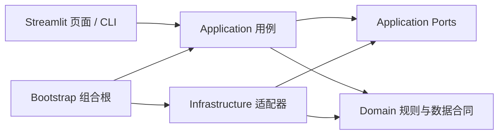

# DataForge 架构与技术栈

平台主运行时统一使用 Python 3.11：Streamlit 提供桌面浏览器工作台，Python 应用服务连接数据生成、文件解析、模型调用和持久化。仓库中的 Node 依赖用于已有 Web Component 回归测试与可选插件开发，不作为平台启动服务，也不引入第二套产品 API。

Windows double-click startup uses the windowless launcher and the system browser. It is not an embedded desktop window. Directory creation and log opening now fail visibly before dependency loading or service startup. The launcher keeps the single-instance lock and health checks after logging is available. Tests cover blocked data paths and blocked log paths using real temporary filesystem entries; Windows message-box delivery is mocked in those tests.

## 洋葱依赖方向

```mermaid
flowchart LR
  UI[Streamlit 页面 / CLI] --> APP[Application 用例]
  APP --> PORTS[Application Ports]
  APP --> DOMAIN[Domain 规则与数据合同]
  INFRA[Infrastructure 适配器] --> PORTS
  INFRA --> DOMAIN
  BOOT[Bootstrap 组合根] --> APP
  BOOT --> INFRA
```

Domain 不依赖框架、磁盘或模型 SDK。Application 描述用户动作、用例与向外部能力请求的端口。Infrastructure 实现端口，并负责文件、SQLite、LLM API、文档解析和压缩包。Presentation 只呈现状态、收集输入并调用用例。Bootstrap 是唯一负责把应用用例接到实际适配器的位置。

## 当前迁移状态

自动数据生成、工作区选择、数据目录、生成偏好设置、模型后端与密钥配置，SFT 对话、CPT 语料、DPO/ORPO 偏好审核，以及旧对话样本的质量报告与版本导出已形成洋葱式切片：

| 边界 | 当前目录 | 职责 |
| --- | --- | --- |
| Domain | `lib/domain/` | 训练目标、数据资产分类、导出合同、JEV/对话质量规则、工具与整数算术核验、模型后端配置规则，以及 SFT/CPT/偏好审核规则 |
| Application | `lib/application/` | 自动工作流、工作区、数据目录、生成设置、模型后端管理和训练数据审核用例与端口协议 |
| Infrastructure | `lib/infrastructure/` | 文件工作流执行器、受限且避开链接的数据目录扫描与下载、固定配置文件的原子更新、审核事件及版本化发布、模型配置/密钥/审计适配 |
| Bootstrap | `lib/bootstrap/` | 工作流、工作区、生成设置、模型后端和训练数据审核依赖装配 |
| Presentation | `lib/presentation/streamlit/` 与 `lib/webapp.py` | 数据生成工作台、真实样本预览、数据目录、任务运行图、打包和统一人工审核工作区 |

现有完整控制台和旧 CLI 仍保留在 `lib/webapp.py`、`lib/cli.py`；历史 SFT/rollout 审核中心、模型训练、旧文档管线、通用导出器和监控暂时仍由兼容模块承接。数据目录现在由 `AssetCatalogApplication` 返回文件元数据，受限读取与链接检查在 `FilesystemAssetCatalogDriver` 中完成，页面不递归扫描磁盘。旧审核中心的无损样本修订规则已抽入 `lib/domain/review_edit.py`，字段级 AI 建议由 `ReviewEditApplication` 经 `ReviewSuggestionPort` 调用模型适配器；`lib/review_editor.py` 仅保留旧调用入口。自动工作流产生的 SFT、CPT、DPO 与 ORPO 样本均可在统一审核工作区复核并形成独立审核版本。`lib/workflow.py`、`lib/workflow_quality.py`、`lib/math_tasks.py` 与 `lib/backend_manager.py` 是迁移期的旧导入入口，新代码应依赖 Application 用例或 Domain 包。

继续迁移时按业务闭环移动“人工审核与审核存储 → 版本化导出与数据集注册 → 文档/会话生成 → 模型训练与监控”。每条闭环先定义纯 Domain 合同和 Application 端口，再接 Infrastructure 适配器，最后迁移页面和 CLI。只有调用点迁移并通过原行为回归后才移除兼容入口；不在重构期间改写用户数据目录。

生成偏好页面由 `lib/presentation/streamlit/generation_settings_page.py` 呈现，经 `GenerationSettingsApplication` 读取和校验固定的三份 YAML；文件适配器按预期内容比较、保留原版备份并原子替换。配置语法错误时，页面仍提供高级编辑入口用于修复。页面不再直接读写这些配置文件。

CPT 文档导入按 UTF-8、GB18030 显式解码，无法解码的来源会隔离并给出 `invalid_encoding`，而非替换乱码继续生成。语料规范化保留独占一行的数字及代码缩进，避免把真实编号或程序片段误当页码噪声删除。
CPT 打包前复核任务创建时锁定的同工作区人工审核版本，并对当前批次与这些发布版本做保守精确/近重复筛查；跨批匹配会保留参考运行、版本、行号和相似度。用户也可为 CPT 任务提供本地 JSON/JSONL 评测参照，来源快照与哈希锁定在运行配方中，打包前验证并隔离命中候选；Domain 的重叠索引只返回参照 ID 和位置，不返回评测原文。此检查只覆盖上传的参照，候选索引可能漏检，且目前尚无训练后的数据效用基准。

Agent 回放的纯状态机合同在 `lib/domain/agent_sandbox_contract.py`，可选 Docker 执行器在 `lib/infrastructure/agent_docker_replay.py`。Domain 只接受 `SandboxReplayPort` 返回的标量结果与摘要证据，完整轨迹和终态目标都要核对；Infrastructure 把有界动作与来源快照通过 stdin 交给固定摘要镜像，容器不能挂载宿主文件或联网。任务创建时锁定镜像，未配置或容器不可用不会降低默认本地工具适配器的验证要求。

旧对话样本的结构检查、当前内容审核共识与版本放行规则现位于 `lib/domain/release_quality.py`，`ReleaseApplication` 经端口读取样本和审核票、写出带清单的版本；CLI 和控制台通过 `lib/bootstrap/releases.py` 调用。`lib/quality.py` 只保留兼容入口，文件格式转换器仍由旧 `lib/exporters.py` 提供。这里的审核覆盖与结构检查不等于事实准确性证明。

## 工作流依赖规则

审核分页合同现在通过 Application 端口传入数据适配器。CPT、SFT、DPO、ORPO 按全队列状态筛选后分页，页面每次最多读取 100 条，默认 20 条；待审队列完成最后一页后会自动回到有效页码。基础设施为已校验产物建立可重建的 SQLite 索引，按来源哈希和索引版本失效；候选正文和来源证据在索引建立时逐条读取，翻页只解析当前页。索引只在运行的 `human-review/.indexes/` 下缓存，不改变原始产物或人工审核事件，发布仍重新校验原始产物。SFT 审核页复用数据预览的真实轮次卡片，输入、助手回答、工具调用与返回保持原始顺序。

5 万条离线 SFT 候选（每条约 1 KB 回答）的本地检查中，首次校验并建索引约 12.66 秒，索引就绪后读取末尾 20 条约 0.16 秒，Python 分配追踪峰值约 0.26 MiB。该检查包含产物哈希核对与当前页来源证据，不调用模型；不是模型生成吞吐量或整个进程内存的测量。审核事件现在统一写入 SQLite 事务存储，单条保存追加事件并更新当前决定。旧 JSON 记录逐条校验并事务迁入，原文件保留且检测后续修改。完整发布逐条写出训练数据与审计快照，并在磁盘生成和复核 ZIP；页面只保留版本摘要，点击下载才读取归档。Streamlit 下载仍可能分配整个归档的字节缓冲，这不等于 HTTP 流式下载。

同一套 5 万条离线候选全部审核后，读取末尾 20 条约 0.83 秒，追加单条决定约 0.08 秒；完整发布生成约 6.57 MiB ZIP，Python 分配追踪峰值约 7.6 MiB。开启 `tracemalloc` 时发布耗时约 270.51 秒，此数值包含完整审计与产物复核，不能当作无追踪环境的性能或模型吞吐量。审核发布现经 Application 的后台任务端口启动固定本地子进程；状态在 `human-review/.jobs/` 下落盘，页面只轮询来源、审核记录、样本写出、快照、压缩与完整性校验阶段。活动文件锁判定工作进程，刷新或控制台重启后可恢复查看；失去工作锁的运行任务标记中断，可重新打包。停止是检查点协作停止，保留既有完整版本与未发布的暂存文件，不提供逐字节恢复压缩。发布期间页面暂停当前批次审核，避免争用全量校验持有的锁。

- `lib/domain` 不能导入 `lib.application`、`lib.infrastructure`、`lib.bootstrap`、Streamlit 或 LLM SDK。
- `lib/application` 可以依赖 Domain 和自己定义的 Protocol；不能直接导入 Infrastructure、Presentation 或框架。
- `lib/infrastructure` 可以实现 Application 的 Protocol 并调用 Domain 规则。
- `lib/bootstrap` 装配具体实现；UI/CLI 通过 Application 服务进入工作流。
- Infrastructure 中的文件布局、模型 SDK 与数据库实现不能泄漏进业务合同；页面使用预览、状态和打包用例读取工作流。

节点模型草稿与提交快照由 `WorkflowNodeModelsApplication` 经库存端口处理，Domain 负责首次默认选择、所需角色与服务存在性检查。工作台不再直接调用旧 backend 管理模块。已有节点的手动选择不随全局默认变化；服务消失时保留原选择并提示修复，画布标出缺配置节点，未修复前禁用启动。提交时再次读取库存，避免使用页面渲染时过期的服务列表。自定义模型名仍可使用，服务中的模型列表不当作远端可用性的证明。
### Large-run recovery visibility

The run inspector separates verified item checkpoints reused in the current attempt from newly processed units. Newly processed units can still reuse saved model responses, so this count is not a count of new model calls. Resume keeps the original source snapshots and node recipe. The execution engine verifies pinned recipe, prompt, source, and model identities before proceeding.

Input quarantine previews use the incremental JSON-array reader through the workflow application port. The application caps requests at 100 records. The filesystem adapter stops at the requested number of quarantined records and closes the reader. This bounds preview memory while preserving the saved complete input records. Finding rare quarantined rows can still require scanning the source array; this preview is not an indexed page.
### Automatic workflow archive delivery

Automatic candidate ZIP files are written to the run's `delivery/` directory. Archive preparation verifies source files, writes a temporary ZIP, streams all archived members for hash verification, rechecks the source manifest, and atomically publishes the ZIP and a small reference. The manifest fingerprint identifies the archive. Concurrent preparation is serialized by a file lock. Failed preparation never creates a ready reference.

The package page retains only path, byte count, fingerprint, and SHA-256 in its session. A fresh session discovers the saved package through the application port. A changed manifest invalidates the cached package; damaged ZIP bytes require preparation again. Package inventory and cached delivery discovery share one source verification per page render. Individual trainer downloads are deferred and rechecked by the infrastructure adapter.

Browser downloads are capped at 50 MiB. Larger prepared archives remain available through their displayed local paths. This bounds browser delivery buffers while allowing large local datasets. Automatic archive preparation now shares the durable local worker mechanism with human-review publication. Its job state is isolated under `delivery/.jobs/workflow.json`. The page polls only that small status file while active, with source verification, compression, archive verification, source recheck, and publication phases. Compression and archive verification report actual byte totals and check cancellation between chunks. Source verification remains a whole-file check, so cancellation can wait for that check to finish. Interrupted jobs can be retried; existing complete archives remain available. Compression retries start a new temporary ZIP rather than resume compressed bytes.
### Long-message preview controls

Training artifact previews opt into collapsible message rendering for content or tool payloads longer than 1,600 characters. The compact summary contains a short escaped excerpt. The complete rendered message remains inside a named, keyboard-focusable scroll region with a maximum height of 420 pixels. Tool-call grouping, recorded ordering, and failure markers stay outside the collapsed payload. English controls are translated while excerpts and full training text retain their original language. The shared renderer's default remains unchanged for callers that do not request compact previews. This controls visual height; it is not lazy DOM loading of an individual message.

Long plain-text corpus, evidence, and structured-record previews share the same compact disclosure and scroll region as long messages. Evidence and unknown structured rows are no longer silently truncated. Full payloads remain in the rendered DOM; these controls bound visible height rather than payload memory. Nested body scrolling is disabled inside the full-content region so keyboard scrolling has one target.

### Agent node verification choice

The Agent setup node owns the local or isolated replay choice. A separate session draft survives switching to another node. Isolated replay requires a valid pinned image configuration before starting; actual Docker availability is checked during execution. The application capability reports configuration only. Task creation validates the current configuration again and stores the selected image in the immutable recipe. Explicit local replay ignores the container environment. Existing CLI callers retain the configured environment default. The node explains conservative duplicate pruning and the separate destination for failed traces; neither mechanism makes uploaded snapshots proof of external truth.

### Creation and run inspection

The creation workbench lists past runs without rendering their execution details. Opening a selected run uses the same task-center handoff as starting a new run. The task center owns live inspection, checkpoint retry, and packaging navigation. This avoids reading a selected historical run's artifacts and event details during creation form rerenders, and keeps old failures separate from a new configuration. Refreshing a workspace still discovers its persistent history.

Task cards use pages of 50 matching runs. Filter or search changes reset the page; pagination clamps after the number of matches changes. Explicit creation/history handoffs clear stale filters and search, and locate the selected run's page before choosing the visible record. This bounds rendered task cards, not the run inventory read by the adapter.

The task-center and creation-history views now use a separate task-inventory application port. Its filesystem adapter caches compact summaries for up to 2,048 file identities. Summaries retain card fields, stage labels/statuses, and three recent events. Each access checks the state's nanosecond modification/change times, size, and inode; reading across a replacement retries before caching. Callers receive copies. Other workflow consumers and selected-run inspectors still read authoritative full states. The first read and cache misses parse a full state, and directory inventory still scans all run paths. This is not a persistent indexed inventory or a guarantee against undetectable external metadata-preserving edits.

User-owned workflow names use the `UntranslatedText` string marker when passed through localized Streamlit labels. Run headings and task-card buttons keep the original name. History options translate the system status separately, then preserve the combined label. Their language is captured during rendering so formatting outside the Streamlit script context stays stable. Stage inspector status and percentage use separate text nodes to translate the status consistently.

HTML user-content regions use `data-user-content` to preserve text and nested attributes through markup localization. Package task/release names, source names, and file names use this marker. Run configuration values mark actual source names, model identifiers, and written briefs, while empty-brief and missing-model placeholders remain system copy. This is a localization boundary, not an HTML safety mechanism; values are still escaped before rendering.
